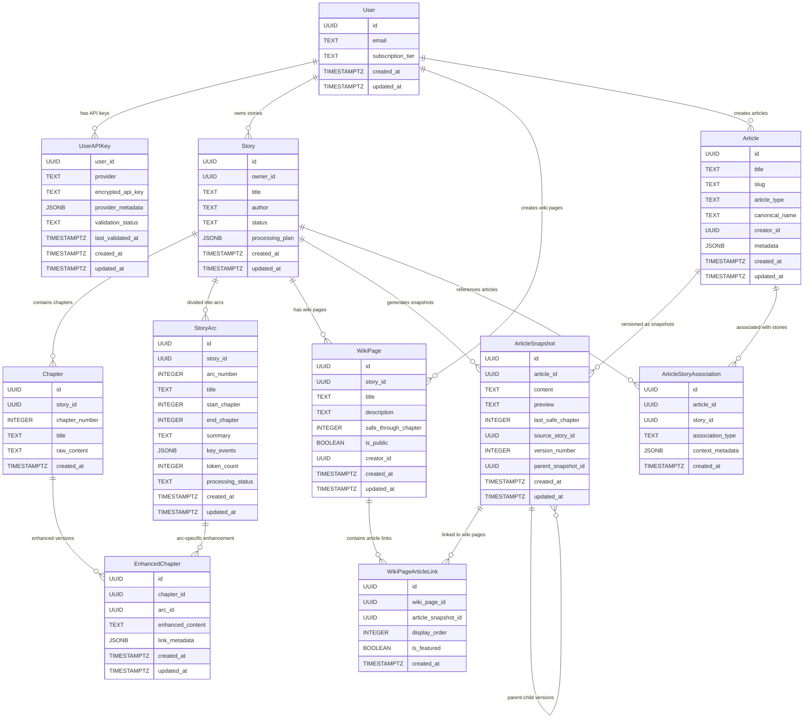

# Repository Architecture and Implementation

## Table of Contents
1. [Repository Abstraction Pattern](#repository-abstraction-pattern)
2. [Current Repository Implementation](#current-repository-implementation)
3. [Data Relationships and Architecture](#data-relationships-and-architecture)
4. [Spoiler Prevention Through Article Snapshots](#spoiler-prevention-through-article-snapshots)
5. [Implementation Details](#implementation-details)

---

## Repository Abstraction Pattern

### Philosophy

ShuScribe implements a **dual-mode storage architecture** using the Repository pattern to abstract data persistence. This design enables the same application logic to work seamlessly in both local development and web deployment environments without code changes.

### Core Benefits

1. **Environment Flexibility**: Switch between local development and production deployment
2. **Testing Simplicity**: In-memory repositories enable fast, isolated tests
3. **Consistent Interface**: Same API regardless of underlying storage mechanism
4. **Future Extensibility**: Easy to add new storage backends (e.g., different databases)

### Architecture Overview

```python
# Abstract Interface
class AbstractStoryRepository(ABC):
    async def create_story(self, story_create: StoryCreate) -> Story:
        pass
    
    async def get_story(self, story_id: UUID) -> Optional[Story]:
        pass
    
    # ... other methods

# In-Memory Implementation (Local/CLI)
class InMemoryStoryRepository(AbstractStoryRepository):
    def __init__(self):
        self._stories: Dict[UUID, Story] = {}
        self._chapters: Dict[UUID, Chapter] = {}
        # ... other collections
    
    async def create_story(self, story_create: StoryCreate) -> Story:
        # Implementation using Python dictionaries
        pass

# Supabase Implementation (Web)
class SupabaseStoryRepository(AbstractStoryRepository):
    def __init__(self, supabase_client: Client):
        self.client = supabase_client
    
    async def create_story(self, story_create: StoryCreate) -> Story:
        # Implementation using Supabase client
        pass

# Factory Function
def get_story_repository() -> AbstractStoryRepository:
    if settings.SKIP_DATABASE:
        return InMemoryStoryRepository()  # Local mode
    else:
        return SupabaseStoryRepository(supabase_client)  # Web mode
```

### Configuration-Driven Selection

The storage backend is automatically selected based on the `SKIP_DATABASE` environment variable:

- **`SKIP_DATABASE=true`**: Uses in-memory repositories (local/CLI mode)
- **`SKIP_DATABASE=false`**: Uses Supabase repositories (web deployment)

---

## Current Repository Implementation

Our system implements three main repository abstractions:

### 1. Story Repository
Manages stories, chapters, story arcs, and enhanced chapters.

### 2. Wiki Page Repository  
Manages wiki pages, articles, article snapshots, and their relationships.

### 3. User Repository
Manages users, API keys, and user progress (web mode only).

---

## Data Relationships and Architecture

### Core Entity Relationships



The above diagram shows the complete data model and relationships in our repository system.

### Key Architectural Concepts

#### 1. **Story Processing Flow**
```
Raw Story → Chapters → Story Arcs → Wiki Articles → Article Snapshots → Wiki Pages
```

- **Stories** are divided into **Chapters** (raw content)
- **Story Arcs** group chapters for processing (e.g., Arc 1: Chapters 1-5)
- **Articles** represent wiki entities (characters, locations, concepts)
- **Article Snapshots** are versioned content tied to specific chapter safety levels
- **Wiki Pages** collect appropriate snapshots for spoiler-safe viewing

#### 2. **Separation of Content and Presentation**
- **Articles**: Base entities (characters, locations, etc.) that can be shared across stories
- **Article Snapshots**: Story-specific versions with appropriate spoiler levels
- **Wiki Pages**: Curated collections of snapshots for specific reading progress

#### 3. **Multi-Story Universe Support**
- Articles can be referenced by multiple stories via **ArticleStoryAssociation**
- Each story generates its own snapshots of shared articles
- Wiki pages are story-specific but can reference shared article entities

---

## Spoiler Prevention Through Article Snapshots

### The Spoiler Problem

When generating wikis for ongoing stories, we face a fundamental challenge:
- Early chapters introduce characters with basic information
- Later chapters reveal major plot points, secrets, or character deaths
- Readers at different points need different levels of information

### Solution: Versioned Article Snapshots

Our system solves this through **Article Snapshots** - versioned content tied to specific chapter safety levels:

```python
class ArticleSnapshot(BaseModel):
    id: UUID
    article_id: UUID                    # Which article this is a version of
    content: str                        # Full article content at this spoiler level
    preview: str                        # Short preview for tooltips
    last_safe_chapter: int              # Safe to read through this chapter
    source_story_id: UUID               # Which story generated this version
    version_number: int                 # Version within this story
    parent_snapshot_id: Optional[UUID]  # Previous version (for history)
```

### Example: Character Article Evolution

Consider a character "Dr. Aris" across 10 chapters:

```python
# Chapter 2 version - Basic introduction
ArticleSnapshot(
    article_id=dr_aris_id,
    content="Dr. Aris is a mysterious scientist who appears in Chapter 1...",
    last_safe_chapter=2,
    version_number=1
)

# Chapter 5 version - More background revealed
ArticleSnapshot(
    article_id=dr_aris_id,
    content="Dr. Aris is a former government researcher who was fired for...",
    last_safe_chapter=5,
    version_number=2,
    parent_snapshot_id=version_1_id
)

# Chapter 8 version - Major spoiler revealed
ArticleSnapshot(
    article_id=dr_aris_id,
    content="Dr. Aris is actually the protagonist's father and the main villain...",
    last_safe_chapter=8,
    version_number=3,
    parent_snapshot_id=version_2_id
)
```

### Wiki Page Safety Filtering

**Wiki Pages** act as spoiler-safe collections by linking to appropriate snapshots:

```python
# Wiki for readers through Chapter 3
wiki_early = WikiPage(
    title="Early Story Wiki",
    safe_through_chapter=3,
    # Links to version 1 of Dr. Aris (safe through chapter 2)
)

# Wiki for readers through Chapter 6  
wiki_mid = WikiPage(
    title="Mid Story Wiki", 
    safe_through_chapter=6,
    # Links to version 2 of Dr. Aris (safe through chapter 5)
)
```

### Query Safety

Repository methods enforce spoiler safety:

```python
# Get wiki snapshots safe for reader at chapter 4
snapshots = await wiki_repo.get_wiki_page_snapshots(
    wiki_page_id=wiki_id,
    max_safe_chapter=4  # Only returns snapshots with last_safe_chapter <= 4
)
```

---

## Implementation Details

### Repository Method Categories

#### Story Repository Methods

**Story Management:**
- `create_story()`, `get_story()`, `update_story()`, `delete_story()`, `list_stories()`

**Chapter Management:**
- `create_chapter()`, `get_chapters()`, `update_chapter()`, `delete_chapter()`
- `get_chapters_for_story()` - Get all chapters for a story

**Story Arc Management:**
- `create_story_arc()`, `get_story_arcs()`, `update_story_arc()`, `delete_story_arc()`
- Arc-based processing tracking for incremental wiki generation

**Enhanced Chapter Management:**
- `create_enhanced_chapter()`, `get_enhanced_chapters()`
- Chapters with wiki links added by processing agents

#### Wiki Page Repository Methods

**Wiki Page Management:**
- `create_wiki_page()`, `get_wiki_page()`, `update_wiki_page()`, `delete_wiki_page()`
- `list_wiki_pages()` - Get all wiki pages for a user/story

**Article Management:**
- `create_article()`, `get_article()`, `update_article()`, `delete_article()`
- `search_articles()` - Search with filters (type, tags, etc.)

**Article Snapshot Management:**
- `create_article_snapshot()`, `get_article_snapshots()`, `update_article_snapshot()`
- `get_article_snapshots(article_id, story_id)` - Get all versions for article in story

**Association Management:**
- `create_article_story_association()` - Link articles to stories
- `get_article_stories()`, `get_story_articles()` - Query associations

**Wiki Page Composition:**
- `create_page_snapshot_link()` - Add snapshot to wiki page
- `get_wiki_page_snapshots()` - Get all snapshots for a wiki page
- `get_page_snapshot_links()` - Get link metadata

### In-Memory Implementation Details

#### Data Storage Structure
```python
class InMemoryStoryRepository:
    def __init__(self):
        # Primary collections
        self._stories: Dict[UUID, Story] = {}
        self._chapters: Dict[UUID, Chapter] = {}
        self._story_arcs: Dict[UUID, StoryArc] = {}
        self._enhanced_chapters: Dict[UUID, EnhancedChapter] = {}
        
        # Indexes for efficient lookups
        self._chapters_by_story: Dict[UUID, List[UUID]] = defaultdict(list)
        self._arcs_by_story: Dict[UUID, List[UUID]] = defaultdict(list)
        self._enhanced_by_story: Dict[UUID, List[UUID]] = defaultdict(list)
        self._enhanced_by_arc: Dict[UUID, List[UUID]] = defaultdict(list)
```

#### Relationship Management
The in-memory implementation maintains referential integrity through:
- **Automatic indexing**: When entities are created, they're automatically indexed by relationships
- **Cascade operations**: Deleting a story removes all related chapters, arcs, etc.
- **Constraint enforcement**: Foreign key relationships are validated

#### Performance Optimizations
- **Dictionary lookups**: O(1) access to entities by ID
- **Index maintenance**: Relationship indexes updated on mutations
- **Lazy loading**: Related entities loaded only when requested

### Testing Strategy

#### Repository Testing Approach
```python
# Abstract test class for both implementations
class AbstractStoryRepositoryTest:
    @pytest.fixture
    def repo(self) -> AbstractStoryRepository:
        raise NotImplementedError  # Implemented by concrete test classes
    
    async def test_create_story(self, repo):
        # Test implementation independent of storage backend
        pass

# Concrete test implementations
class TestInMemoryStoryRepository(AbstractStoryRepositoryTest):
    @pytest.fixture
    def repo(self):
        return InMemoryStoryRepository()

class TestSupabaseStoryRepository(AbstractStoryRepositoryTest):
    @pytest.fixture  
    def repo(self):
        return SupabaseStoryRepository(supabase_client)
```

This approach ensures both implementations behave identically.

### Factory Functions and Dependency Injection

Repository factories automatically select implementations:

```python
# Factory functions in __init__.py files
def get_story_repository() -> AbstractStoryRepository:
    if settings.SKIP_DATABASE:
        return InMemoryStoryRepository()
    else:
        return SupabaseStoryRepository(get_supabase_client())

def get_wikipage_repository() -> AbstractWikiPageRepository:
    if settings.SKIP_DATABASE:
        return InMemoryWikiPageRepository()
    else:
        return SupabaseWikiPageRepository(get_supabase_client())

# Usage in application code
story_repo = get_story_repository()  # Automatically gets correct implementation
wiki_repo = get_wikipage_repository()
```

### Migration and Schema Evolution

#### Supabase Migrations
- SQL migration files for schema changes
- Version-controlled database evolution
- Automated deployment through CI/CD

#### In-Memory Schema Changes
- Python data model updates
- No migration scripts needed
- Backward compatibility through code

### Performance Characteristics

#### In-Memory Performance
- **Reads**: O(1) for primary key lookups, O(n) for searches
- **Writes**: O(1) for creates/updates, plus index maintenance
- **Memory Usage**: All data held in RAM, efficient for development/testing
- **Scalability**: Limited by available system memory

#### Supabase Performance  
- **Reads**: Optimized through database indexes and caching
- **Writes**: ACID transactions with PostgreSQL performance
- **Memory Usage**: Minimal application memory footprint
- **Scalability**: Horizontal scaling through managed PostgreSQL

### Future Extensibility

The repository pattern enables future enhancements:

1. **Additional Storage Backends**: Redis, MongoDB, etc.
2. **Caching Layers**: Repository decorators for caching
3. **Event Sourcing**: Audit trails and change history
4. **Multi-tenancy**: Tenant-aware repository implementations
5. **Read Replicas**: Read-only repository implementations for scaling

---

## Summary

Our repository architecture provides:

- **Flexibility**: Same code works in local and production environments
- **Testability**: Fast, isolated testing with in-memory storage
- **Consistency**: Identical behavior across storage backends
- **Complexity Management**: Clean separation of business logic from storage concerns
- **Spoiler Safety**: Sophisticated versioning system prevents story spoilers
- **Scalability**: Foundation for future performance and feature enhancements

The combination of the Repository pattern with versioned Article Snapshots creates a robust system for managing complex story wikis with spoiler prevention while maintaining development velocity and deployment flexibility.
